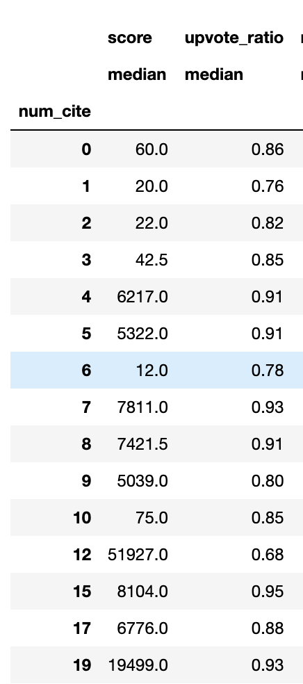

# Subreddits Analysis - AskScience

Ramin Anushiravani

August 6th/2023

## What? 

We're given a collection of posts from collection of posts from the subreddit r/askscience [here](data/askscience_data.csv).  
We're interested to learn more about two things, 

1- attributes of a successful post on r/askscience

While a clear correlation from metadata included in this dataset did not show any clear sign of what makes a post successful (in this case successful is higher score) the analysis included in the notebook shows that some are more important than other, such as the tag of a post, length of the title or body. 

I did not use the up-vote ratio to predict the scores as they are heavily correlated as they say the same thing about the success of a post. 

Other important factors where number of citations or the number of questions asked in the body or title. The year in which a post was posted seemed to be also of importance within this dataset, however, in practice access a model that predict a success of a post in real-time cannot use such feature. Other features such as the day or the month did not seem to affect the upvote-ratio, although they seemed to have correlation with the raw score. Where year is negatively correlated to score and positively correlated to up-vote ratio. 

These inference however cannot be granted as a true signal since the dataset size is too small and not uniform over time. 

Note, if we had access to more features, feature importance could have also been infered from random forest or gradient boosting. 

2- Build a model that can predict the score of a post on r/askscience using the title and body of the post or any other metadata included in the dataset. 

After analyzing the score distribution, I decided to treat this problem as a classification problem instead of regression. 

As you can see in the score distribution the scores is much denser in the low score and the upvote-ratio distribution is not normal. After studying these lower scores, it seems like some are due to the author deleting the post and some may have not been captured at the time (or data quality issues) as they have scores associated with them. These posts without scores will only confuse the ML model as the post does contain a higher score. 

Hence I quantile the raw scores to 20 bins (because the classes would be more balanced that way) and trained a model that would predict which score bucket a post would belong to. Higher bucket meaning the post is maybe more succesful. 

After studying the data more closely I decided to remove the rows that correspondent to zero scores. More discussed in the notebook. Here you can see the distribution of the classes prior to removing these smaples. 

Here you can see the distribution of the classes after removing these samples. 

You can see the model architecture here: 

## Where? 

You can find the main notebook that tackle this challenge [here](notebook/Subreddits_Analysis_AskScience.ipynb)

Another notebook that extract comments from reddit posts is included [here](notebook/extracting_comments_from_posts.ipynb)

For easier access, I also included the HTML format of the notebooks [here](htmls/extracting_comments_from_posts.html) and [here](htmls/Subreddits_Analysis_AskScience.html))

Some text data utility is included [here](utils/data_utility.py)

Associated model artifacts and data processing steps are included [here](data/) though some are not included due to their size. 

Following notebooks where ran on 3.8.12. Please use the [requierments](requierments.txt) to create a python environment for running the notebook. 

# Alternative Solution 

Note that the recent advances in Generative AI and instruction fine-tuning could also be be an alternative solution for this problem. For example, using few-shot learning one could find the intstruction templates that could find an optimal set of instructions and give this datasets as a set of instructions, chain-of-thoughts or in-context learning to first fine tune an LLM and then using it for predicting the score of each post. 

For Example, we could loop over our dataset and collect these information. 

reddit_post_template = 

    """
    
        For the following text, predict the score of the post:

        extract the title of the post : {title}

        extract the body of the post and save its summary : {body}

        what science topic is the post asking? Pick one or more of these topics biology, physics, chemistry, humantiy, ai. : {topic} 

        predict if the post has a positive, negative or a neutral tone. {sentiment}

        Extract any sentences that maybe harmful. : {harmless}

        Extract any sentences that maybe helpful. : {hepful}

        use the title, body, topic, sentiments, harmful sentences, and helpful sentences to predict the score of the post : {score}

    """